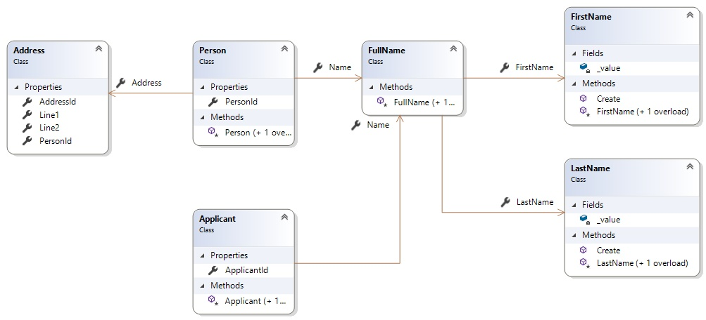

# OwnedTypes
This repository contains code to demonstrate an error I'm getting when using Proxies in EF Core 2.1.0-rc1-final

OwnedTypes project is working without any exception. 

OwnedTypes.NotWorking gives the following exception when I query for data already in the database.

```
{System.NullReferenceException: Object reference not set to an instance of an object.
   at lambda_method(Closure , QueryContext , Person , Object[] )
   at Microsoft.EntityFrameworkCore.Query.Internal.IncludeCompiler._Include[TEntity](QueryContext queryContext, TEntity entity, Object[] included, Action`3 fixup)
   at lambda_method(Closure , TransparentIdentifier`2 )
   at System.Linq.Enumerable.SelectEnumerableIterator`2.MoveNext()
   at System.Linq.Enumerable.TryGetFirst[TSource](IEnumerable`1 source, Boolean& found)
   at lambda_method(Closure )
   at Microsoft.EntityFrameworkCore.Query.Internal.LinqOperatorProvider.ResultEnumerable`1.GetEnumerator()
   at Microsoft.EntityFrameworkCore.Query.Internal.LinqOperatorProvider.<_TrackEntities>d__17`2.MoveNext()
   at Microsoft.EntityFrameworkCore.Query.Internal.LinqOperatorProvider.ExceptionInterceptor`1.EnumeratorExceptionInterceptor.MoveNext()
   at System.Linq.Enumerable.TryGetFirst[TSource](IEnumerable`1 source, Boolean& found)
   at System.Linq.Enumerable.First[TSource](IEnumerable`1 source)
   at Microsoft.EntityFrameworkCore.Query.Internal.QueryCompiler.<>c__DisplayClass15_1`1.<CompileQueryCore>b__0(QueryContext qc)
   at System.Linq.Queryable.FirstOrDefault[TSource](IQueryable`1 source)
   at OwnedTypes.NotWorking.Program.Main(String[] args) in ...\OwnedTypes\OwnedTypes.NotWorking\Program.cs:line 26}
```

# What's Comman between OwnedTypes Project and OwnedTypes.NotWorking project

They both uses EF Core 2.1.0-rc1-final

They both have the following model.



`FullName`, `FirstName` and `LastName` are OwnedTypes (`ValueObjects` in `DDD`)

Both console applications will Create a database called OwnedTypesTestDb in your localdb, insert some data and query those inserted data.

`Program.cs` has the following code

```
class Program
{
    static void Main(string[] args)
    {
        using (TestDbContext db = new TestDbContext())
        {
            db.Database.EnsureDeleted();
            db.Database.EnsureCreated();

            db.Applicants.Add(new Applicant(new FullName(FirstName.Create("Amila"), LastName.Create("Udayanga"))));

            var person = new Person(new FullName(FirstName.Create("Amila"), LastName.Create("Udayanga")));
            person.Address = new Address { Line1 = "Line1", Line2 = "Line2" };
            db.People.Add(person);
            db.SaveChanges();
        }

        using (TestDbContext db = new TestDbContext())
        {
            var people = db.People.FirstOrDefault();
            var applicants = db.Applicants.ToList();
            var addresses = db.Addresses.ToList();
        }
    }
}
```

As you can see, I have two `using` statements. It works fine if I have the code as follows (all the code in one `using` statement).

```
class Program
{
    static void Main(string[] args)
    {
        using (TestDbContext db = new TestDbContext())
        {
            db.Database.EnsureDeleted();
            db.Database.EnsureCreated();

            db.Applicants.Add(new Applicant(new FullName(FirstName.Create("Amila"), LastName.Create("Udayanga"))));

            var person = new Person(new FullName(FirstName.Create("Amila"), LastName.Create("Udayanga")));
            person.Address = new Address { Line1 = "Line1", Line2 = "Line2" };
            db.People.Add(person);
            db.SaveChanges();

            var people = db.People.FirstOrDefault();
            var applicants = db.Applicants.ToList();
            var addresses = db.Addresses.ToList();
        }
    }
}
```

# Difference between OwnedTypes project and OwnedTypes.NotWorking project

OwnedTypes.NotWorking is using Microsoft.EntityFrameworkCore.Proxies and the model is updated with what's required for Proxies to work (i.e. Virtual Navigation Properties, called `UseLazyLoadingProxies()` in `DbContext` configuration)
